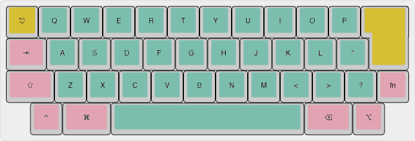

# Tender Mending Sender

staggered 40 with ISO enter

say what you mean, do what you love, and fucking send it




## Layout

40-key staggered keyboard with ISO Enter, 6u spacebar, and ATmega32U4.

### Layer 0 — Default

| | | | | | | | | | | | |
|---|---|---|---|---|---|---|---|---|---|---|---|
| Esc | Q | W | E | R | T | Y | U | I | O | P | Enter (ISO) |
| Tab/Ctrl | A | S | D | F | G | H | J | K | L | ' | |
| Shift | Z | X | C | V | B | N | M | , | . | / | Fn2 |
| | Fn1 | Super | | | Space (6u) | | | | Bksp | AltGr | |

### Layer 1 — Numbers / Punctuation (Fn1)

| | | | | | | | | | | | |
|---|---|---|---|---|---|---|---|---|---|---|---|
| | | | | | | | 7 | 8 | 9 | 0 | |
| | \` | \\ | [ | ] | - | = | 4 | 5 | 6 | ; | |
| | | | | | , | . | 1 | 2 | 3 | | |
| | | | | | | | | | | | |

### Layer 2 — Navigation / Function (Fn2)

| | | | | | | | | | | | |
|---|---|---|---|---|---|---|---|---|---|---|---|
| | F1 | F2 | F3 | F4 | Vol+ | | | | | PrtScn | |
| | F5 | F6 | F7 | F8 | Vol- | | PgUp | Home | Up | End | |
| | F9 | F10 | F11 | F12 | Mute | | PgDn | Left | Down | Right | |
| | | | | | | | | | Del | | |

## Firmware

QMK firmware source is in `iso_40/`. To compile and flash:

```
qmk compile -kb iso_40 -km default
qmk flash -kb iso_40 -km default
```

Requires `avr-gcc`, `avrdude`, and the QMK CLI. The keyboard directory needs to be copied into your `qmk_firmware/keyboards/` tree before compiling.

Bootloader is Caterina (Pro Micro compatible) — double-tap reset to enter bootloader mode.

## PCB

Designed in KiCad. Gerber files for manufacturing are in `gerbers/`.

Switch footprints from [ai03 MX_Alps_Hybrid](https://github.com/ai03-2725/MX_Alps_Hybrid) and [random-keyboard-parts](https://github.com/ai03-2725/random-keyboard-parts.pretty) (included as git submodules).

## License

[MIT](LICENSE)
